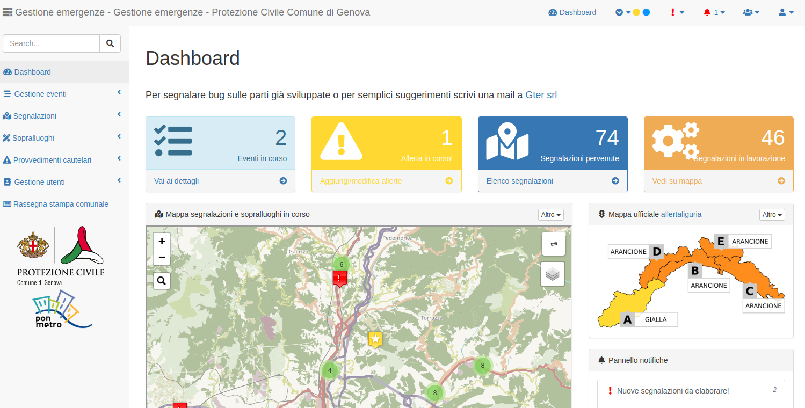

# Web system for emergency management - Sistema informativo per la gestione delle emergenze a scala comunale

Next documentation is in Italian because the system has been developed for an Italian public administration.

## Author

[Gter srl](http://www.gter.it) - +39 010 - 0899150

## Introduzione



Da alcuni anni la Protezione Civile del Comune di Genova ha deciso di dotarsi di un proprio sistema informativo per la gestione delle emergenze. In questo contesto, l’informazione territoriale gioca un ruolo fondamentale. Si tratta di un applicativo web che permette la condivisione delle informazioni fra i vari soggetti sia interni al Comune che esterni (volontari di protezione civile, aziende municipalizzate, VVF, Regione, etc) coinvolti a vario titolo nella gestione delle emergenze e quindi di supportare le operazioni di gestione e mitigazione del rischio. Tale sistema, inizialmente realizzato dal Comune di Genova con risorse interne quale replica di altri sistemi informativi in dotazione all’Ente è stato recentemente completamente rinnovato grazie a dei finanziamenti PON Metro 2014-2020. Il nuovo sistema, realizzato da [Gter srl](http://www.gter.it) , oltre ad aver subito un importante restyling grafico che, a detta degli operatori di protezione civile, ha permesso di incrementarne sostanzialmente l’usabilità, ha ora al centro l’aspetto territoriale. Ogni segnalazione e/o intervento svolto è infatti georeferenziato grazie al collegamento con la toponomastica comunale. Questo nuovo approccio permette di avere in ogni istante un quadro preciso di quanto sta avvenendo sul territorio e pertanto di ottimizzare la gestione delle poche risorse a disposizione. Collegato alle banche dati territoriali, non solo alla toponomastica, ma anche all’anagrafe, e ai principali elementi a rischio (rii, sottopassi etc), il sistema permette di gestire e registrare interventi puntuali quali sgomberi o interdizioni all’accesso in maniera sicura ed efficiente.


## Tecnologie
Il sistema è web-based e basato su un tema bootstrap con una serie di strumenti web che si trovano nella cartella *vendor*

Lato server: 

* il DBMS è PostgreSQL v.11 (min 9.6) con estensione spaziale PostGIS v.2.5 (min 2.4)
* PHP v 7.2 (min 7.1) è il linguaggio con cui sono implementate le pagine web 
* Python 3.7 (min 2.7) è il linguaggio di programmazione principalmente usato per l'interazione con altri sistemi (es. webservice di ARPA Liguria, sistema delle manutenzioni, etc.) 


## Struttura del repository
Le principali cartelle usate dal repository sono
* dist: file javascript e di stile ereditati dal tema *sb-admin-2*  (http://startbootstrap.com/template-overviews/sb-admin-2/ )
* img cartella con le immagini usate dall'applicazione
* pages: pagine web dell'applicazione e script
* vendor: librerie utilizzate (jquery e javascript)
* altre cartelle (data, js, less): eredità del tema bootstrap utilizzato


## Dipendenze
Ci sono alcune librerie che sono state aggiunte come dipendenze. Si tratta di altri repository github che sono direttamente caricati dentro il repo:

Un esempio è la libreria bootstrap-table per realizzare grafici:

Con il comando ```git submodule```  si aggiunge il repository: 

```
git submodule add https://github.com/wenzhixin/bootstrap-table.git vendor/bootstrap-table
```


Quindi si può aggiornare ad una specifica versione il submodule per aggiornare il repository (analogo del comando push).

```
git submodule update --remote vendor/bootstrap-table
cd vendor/bootstrap-table 
git checkout 1.16.0
```

Per "scaricare" l'aggiornamento ai submodules sul proprio server è possibile fare un *sync*: 

```
git submodule sync
```


Le dipendenze (al 2020-05-29) sono:

* https://github.com/stefanocudini/leaflet-search.git
* https://github.com/PHPMailer/PHPMailer.git
* https://github.com/simsalabim/sisyphus.git
* https://github.com/l-lin/font-awesome-animation.git
* https://github.com/gtergeomatica/omirl_data_ingestion.git
* https://github.com/snapappointments/bootstrap-select.git
* https://github.com/stefanocudini/leaflet-list-markers.git
* https://github.com/wenzhixin/bootstrap-table.git

Con pip3 (python package installer) sono stati installati i seguenti moduli necessari al funzionamento del sistema:
* emoji 
* psycopg2 
* pymssql 
* requests 
* setuptools 
* simplejson 
* telepot 
* urllib3 
* logging
* tempfile 

## IL DB
Il DB è PostgreSQL con estensione spaziale PostGIS (v 2.5). Una copia del DB vuota sarà aggiunta al repository quanto prima.


## Il bot telegram 
La configurazione principale del bot telegram avviene nella cartella pages/eventi laddove deve essere incluso il file config.py che ha il seguente contenuto:

```
TOKEN="XXXXXXXXXXXXXXXXXXXXXXXXXXXXXXXXXXXXXXXXXX" #da sostituire

#per ora solo un test su Roberto
chat_id= "XXXXX"

website= "https://emergenze.comune.genova.it/emergenze"
link= "https://emergenze.comune.genova.it/emergenze" #da sostituire con li
```

Il file che regola il bot si chiama **pc_bot_multithread_demo.py** e viene lanciato all'avvio del sistema dal file avvio_bot.sh che a sua volta usa lo script python **forever.py**

In fase di installazione occorre eseguire i seguenti passaggi da root:
- fare un link dello script sh  /etc/init.d/ --> `ln -s /home/......./pages/eventi/avvio_bot.sh /etc/init.d/`
- `chmod +x /etc/init.d/avvio_bot.sh`
- `update-rc.d avvio_bot.sh defaults`

I bot si possono creare e gestire tramite BotFather

## API del Comune di Genova utilizzate
In questo momento il sistema usa le API del comune di Genova usate per interazione con altri servizi. In questo momento per interagire con il *SW Manutenzioni*. 
Le API del Comune di Genova sono richiamate dal codice python *pages/segnalazioni/emergenze2manutenzioni.py* che è a sua volta richiamato dalla pagina php *pages/segnalazioni/chiudi_segnalazione.php* utilizzata appunto alla chiusura di una segnalazione. 
Il sistema di API del Comune di Genova utilizza endpoint comuni a tutti i servizi che gestiscono l'autenticazione e reindirizzando ai singoli webservice (nel caso specifico ai webservice SOAP delle manutenzioni sviluppati da Goadev srl 


## Accesso all'applicazione tramite credenziali SPID
Come illustrato nel manuale utente l'accesso all'applicazione *emergenze* è consentito con
* il sistema SPID per gli utenti esterni
* il sistema di autenticazione dell'ente per utenti interni
La gestione dell'autenticazione è garantita dal sistema SIRAC SSO che è definito tra i service provider SPID 
(https://registry.spid.gov.it/service-providers)

Noto il CF dell'utente il sistema verifica in una tabella del DB PostgreSQL l'appartenenza dell'utente tra quelli di sistema.

Il CF viene passato nel request header e viene controllato dal file *pages/check_evento.php* (https://github.com/ComuneDiGenova/emergenze-pcge/blob/dbdb9f4911d9032b4c3b60712d98018f2e13a64e/pages/check_evento.php#L212)


## I file con le credenziali
Come si può vedere dal file .gitignore ci sono alcuni file con dati sensibili che non sono parte del presente repository e vanno ricreati manualmente per far funzionare  il sistema: 

* *conn.php* :contiene le credenziali di accesso al DB 
```
<?php 
$conn = pg_connect("host=127.0.0.1 port=5432 dbname=emergenze user=XXXXXX password=XXXXXXX");
if (!$conn) {
        die('Could not connect to DB, please contact the administrator.');
}
?>
```

* pages/eventi/conn.py
* pages/eventi/config.py
* pages/incarichi/credenziali_mail.php
* pages/incarichi_interni/credenziali_mail.php
* pages/sopralluoghi/credenziali_mail.php
* pages/provvedimenti_cautelari/credenziali_mail.php
* pages/token_telegram.php
* pages/segnalazioni/token_api_ge.py
* pages/segnalazioni/conn.py
* pages/segnalazioni/conn_mssql.py


## Contatti

* Amministrazione proprietaria: Comune di Genova
* Soggetto incaricato al mantenimento: [Gter srl](http://www.gter.it)
* Contatto e-mail referente di progetto (per segnalazioni e richiesta informazioni): roberto.marzocchi@gter.it
* Contatto e-mail presso l'amministrazione: applicazionisit@comune.genova.it
* Gestione segnalazioni: **tramite issues github**


## Versioning

La prima versione stabile è stata creata nel giugno 2020 all'atto dell'inserimento del SW nel catalogo del riuso.

Altri tag possono essere creati su singoli commit da linea di comando con il seguente comando 
```
git tag -a vX.X.X Commit_number -m "Messaggio"
git push origin vX.X.X
```
Il progetto è stabile al netto di continue migliorie e bug detection che sono possibili attraverso l'uso dell'ambiente in produzione presso la Protezione Civile del Comune di Genova


## Copyleft and License

This web page was developed starting from [Start Bootstrap](http://startbootstrap.com/) - [SB Admin 2](http://startbootstrap.com/template-overviews/sb-admin-2/)
[](https://cdnjs.com/libraries/startbootstrap-sb-admin-2)
[SB Admin 2](http://startbootstrap.com/template-overviews/sb-admin-2/) is an open source, admin dashboard template for [Bootstrap](http://getbootstrap.com/) created by [Start Bootstrap](http://startbootstrap.com/).
which  use the following license: Copyright 2013-2018 Blackrock Digital LLC. Code released under the [MIT](https://github.com/BlackrockDigital/startbootstrap-sb-admin-2/blob/gh-pages/LICENSE) license.

Start Bootstrap was created by and is maintained by **[David Miller](http://davidmiller.io/)**, Owner of [Blackrock Digital](http://blackrockdigital.io/).

* https://twitter.com/davidmillerskt
* https://github.com/davidtmiller

Start Bootstrap is based on the [Bootstrap](http://getbootstrap.com/) framework created by [Mark Otto](https://twitter.com/mdo) and [Jacob Thorton](https://twitter.com/fat).


[Gter srl](http://wwww.gter.it) change the license to GPL v.3 (see license file attached)

This work is financed by [PON Metro 2014-2020](http://www.ponmetro.it) funding.


